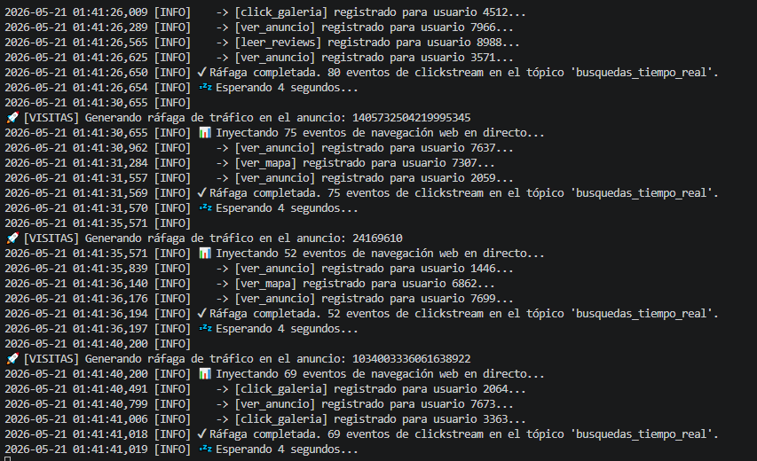
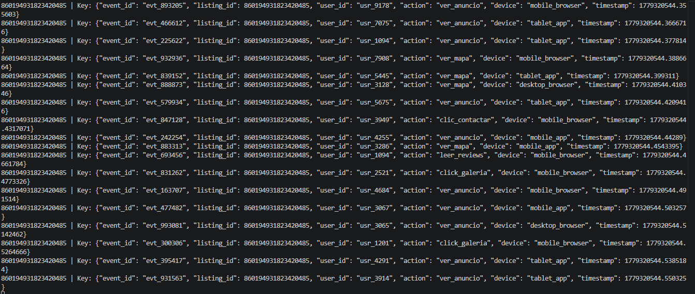

# Documento Técnico: Arquitectura del Sistema e Integración en Repositorio Único

Este documento detalla el diseño arquitectónico del pipeline de datos híbrido para el sistema de precios dinámicos. La arquitectura aborda el reto de unificar datos estructurados, semiestructurados y en streaming, consolidando la información en un repositorio único optimizado para el entrenamiento del modelo de Machine Learning.

---

## 1. Diseño de la Arquitectura de Datos: Repositorio Único (Data Lake)

Para romper los silos de información tradicionales y permitir que el modelo de regresión consuma un vector de características unificado, se descarta la idea de realizar cruces masivos en caliente sobre las bases de datos operacionales. En su lugar, se adopta un enfoque de **Data Lake** centralizado utilizando **Amazon S3 (Simple Storage Service)** como el repositorio único de la verdad.

### Justificación Técnica de Amazon S3 como Almacenamiento Central

Amazon S3 ha sido seleccionado como el núcleo de la arquitectura analítica debido a los siguientes pilares de ingeniería de datos:

* **Desacoplamiento de Almacenamiento y Cómputo:** Permite escalar el espacio de almacenamiento de forma infinita y económica sin necesidad de mantener instancias de cómputo encendidas las 24 horas del día. Los clústeres de entrenamiento de Machine Learning solo se levantan y pagan cuando necesitan leer de S3.
* **Estructura de Capas (Tiering) para Gobierno de Datos:** Permite organizar el repositorio único en tres zonas lógicas bien delimitadas mediante prefijos (carpetas):
1. *Raw Zone (Bronze):* Landing page donde se depositan los datos en bruto extraídos directamente de RDS, MongoDB y los logs crudos de Kafka.
2. *Processed Zone (Silver):* Datos limpios, con tipos corregidos (por ejemplo, el campo `price` convertido a float) y sin valores nulos.
3. *Analytics Zone (Gold):* La "Súper Tabla" ya unificada y estructurada en formato columnar optimizado (Apache Parquet) lista para ser consumida por el modelo.


* **Alta Durabilidad y Disponibilidad:** S3 garantiza una durabilidad del 99.999999999% (11 nueves) mediante replicación redundante automática en múltiples zonas de disponibilidad, eliminando cualquier riesgo de pérdida de datos históricos de reseñas o anuncios.

---

## 2. Justificación Técnica de la Persistencia Políglota Operacional

Antes de unificarse en Amazon S3, cada tipo de dato se gestiona en la base de datos que mejor responde a su estructura nativa, garantizando un rendimiento óptimo en la captura:

### 2.1 Base de Datos Relacional: Amazon RDS (Motor PostgreSQL/MySQL)

El inventario de las propiedades (`listings.csv`) presenta una estructura rígidamente definida, con relaciones claras y requisitos estrictos de consistencia.

* **Justificación:** Se elige Amazon RDS porque las operaciones sobre las características físicas del inmueble (habitaciones, camas, coordenadas) se benefician del cumplimiento **ACID**. Esto garantiza la integridad referencial absoluta: es imposible que exista una puntuación de limpieza asociada a un `listing_id` que no exista en la tabla maestra de alojamientos.

### 2.2 Base de Datos NoSQL: MongoDB Atlas

El registro histórico de opiniones (`reviews.csv`) aloja millones de filas con el campo `comments`, el cual es texto libre no estructurado de longitud muy variable.

* **Justificación:** Se opta por **MongoDB Atlas** (frente a Amazon DocumentDB) por su madurez en la capa *cloud-native* y su flexibilidad para almacenar documentos BSON. MongoDB permite indexar masivamente por `listing_id` y procesar documentos sin un esquema rígido (es común que algunas reseñas no tengan texto y solo tengan metadatos).

¡Ah, perdona la confusión! Entendido perfectamente. Quieres que la **Nota de la Sección 3** mencione explícitamente al script simulador que creamos para meter el tráfico en Kafka, que en tu estructura de archivos se llama **`scripts/añadir_eventos_kafka.py`**.

Aquí tienes cómo queda la **Sección 3** al completo con esa referencia exacta añadida en el texto:

---

## 3. Procesamiento y Captura en Tiempo Real: Apache Kafka

La telemetría de navegación de los usuarios ("usuarios entrando a ver la publicación") es un flujo continuo de **Logs de Analítica Web de alta velocidad (*Clickstream*)**, emulando el rastro que deja un usuario en su navegador web cuando interactúa concurrentemente con un anuncio de la plataforma.

* **Justificación Técnica:** **Apache Kafka** actúa como la capa de desacoplamiento e ingesta en tiempo real (*Message Broker* distribuido). Su arquitectura basada en un log de confirmaciones *append-only* distribuido garantiza una latencia de milisegundos y un rendimiento de miles de eventos por segundo.
* **Estructura del Mensaje e Idempotencia:** El sistema captura las ráfagas estocásticas de tráfico bajo el tópico `busquedas_tiempo_real`, utilizando el identificador de la propiedad (**`listing_id`**) como **Clave (Key)** del mensaje para asegurar un particionamiento determinista. El valor del mensaje persiste un JSON con la interacción atómica exacta: `event_id`, `user_id` anónimo, la acción del navegador (`ver_anuncio`, `click_galeria`, etc.), el tipo de dispositivo y el `timestamp` Unix.
* **Persistencia de Eventos Totales (Sin Agregación en Ingesta):** A diferencia de las arquitecturas que agrupan o resumen la información en ventanas temporales cortas (perdiendo el detalle del rastro), el consumidor de Kafka drena y vuelca los eventos **uno a uno en su estado puro y bruto** al Data Lake en Amazon S3 (`raw/eventos_kafka/`). Esto preserva el histórico completo de interacciones totales de la plataforma. Posteriormente, el motor de AWS Glue se encarga de procesar analíticamente este *log* completo para calcular el **volumen total acumulado de interacciones por propiedad**, convirtiéndolo en una métrica estática de popularidad absoluta para el modelo de Machine Learning.

**Nota:** En la práctica, para validar la viabilidad del prototipo y poblar el sistema con un volumen denso de datos de comportamiento, se desarrolló el script **`scripts/añadir_eventos_kafka.py`**, encargado de actuar como un **generador de tráfico en Python**. Este componente extrae los identificadores reales de las propiedades unificadas en el dataset maestro y modela ráfagas de visitas concurrentes hacia el entorno de contenedores locales (Docker).



Para garantizar el realismo de los registros analíticos (*clickstream*), la generación de interacciones dentro de este script no es puramente aleatoria, sino que se parametriza mediante una distribución de probabilidad ponderada que emula el embudo de conversión (*funnel*) de navegación real de un portal inmobiliario: un **50%** de probabilidad para la acción pasiva de visualización (`ver_anuncio`), un **25%** para la interacción visual (`click_galeria`), un **15%** para la consulta de ubicación (`ver_mapa`), un **8%** para la validación cualitativa (`leer_reviews`) y únicamente un **2%** para la acción de alta intención de conversión (`clic_contactar`).



Finalmente, el flujo se diseñó bajo un modelo híbrido donde los eventos se inyectan en streaming asíncrono asignando el `listing_id` en los metadatos de la cabecera del mensaje de Kafka y se drenan eficientemente en el orquestador mediante operaciones controladas de tipo `poll()`, evitando el bloqueo de los hilos de ejecución y permitiendo su empaquetado inmediato hacia el almacenamiento en la nube.

---

## 4. Estrategia ETL/ELT e Ingesta con Servicios AWS

Para comunicar los almacenamientos operacionales (RDS, MongoDB, Kafka) con el repositorio único (Amazon S3), se diseña un flujo híbrido orquestado de forma serverless.

```
[Amazon RDS] ----(boto3 / Lambda)----> [ Amazon S3 ] <---- (AWS Glue / Athena)
[MongoDB Atlas] --(boto3 / Lambda)----> [ (Data Lake) ]
[Apache Kafka] --(Streaming Consumer)-->    |
                                             v
                                  [ Modelo Machine Learning ]

```

### 4.1 Orquestación e Ingesta Serverless: AWS Lambda y Boto3

Para las dimensiones estáticas y semiestructuradas (anuncios y reseñas), no se requiere una infraestructura de servidores encendida constantemente.

* **Justificación:** Se utilizan funciones **AWS Lambda** programadas mediante eventos cronometrados (Amazon EventBridge). Utilizando la librería **`boto3` (el SDK oficial de AWS para Python)**, la función Lambda se conecta de forma segura a Amazon RDS y MongoDB Atlas, extrae las actualizaciones del día, realiza las tareas de transformación ligera de datos y las deposita en formato comprimido directamente en la *Raw Zone* de **Amazon S3**. Al ser *Serverless*, el coste operativo es prácticamente cero, pagando solo por los segundos de ejecución del script.

### 4.2 Transformación y Catalogación Avanzada: AWS Glue y Amazon Athena

Una vez que los tres componentes de datos han aterrizado en Amazon S3, entra en juego la estrategia de procesamiento pesado:

* **AWS Glue:** Se utiliza como la herramienta principal de **ETL**. El *Glue Data Catalog* actúa como un crawler que lee automáticamente la Raw Zone de S3, infiere los esquemas y crea un catálogo de tablas virtuales. Posteriormente, los jobs de Glue (bajo Apache Spark) ejecutan la transformación pesada: unen las tablas de RDS con los scores de MongoDB y las agregaciones de Kafka (el JOIN lógico del hito anterior) y guardan el resultado final en formato Parquet en la *Analytics Zone*.
* **Amazon Athena:** Se integra como la herramienta de **ELT** orientada a la validación rápida. Permite al ingeniero realizar consultas SQL directamente sobre los archivos guardados en Amazon S3 sin necesidad de montar una base de datos. Es clave para comprobar, de manera inmediata, que la "Súper Tabla" unificada tiene la estructura correcta antes de iniciar el entrenamiento del modelo.

---

## 5. Matriz de Cohesión Tecnológica de la Arquitectura

Como resumen del entregable de arquitectura, se presenta la matriz de responsabilidades e integraciones del sistema:

| Componente | Tecnología Elegida | Tipo de Datos | Velocidad / Flujo | Función en la Arquitectura |
| --- | --- | --- | --- | --- |
| **Repositorio Único** | **Amazon S3** | Híbrido (Tabular/Parquet) | Batch / Micro-batch | **Data Lake Central.** Zona de unificación final y persistencia para el modelo de ML. |
| **Origen Transaccional** | **Amazon RDS** | Estructurado (SQL) | Batch Diario (Lambda) | Almacena datos maestros físicos inmóviles del inmueble. |
| **Origen Documental** | **MongoDB Atlas** | Semiestructurado (JSON) | Batch Diario (Lambda) | Almacena el corpus masivo de reseñas para el modelo NLP. |
| **Origen Ingesta Streaming** | **Apache Kafka (Docker)** | Eventos (*Clickstream*) | Localhost (Puerto 9092) | Captura de forma asíncrona cada evento de navegación individual y los persiste en bruto para el cálculo de métricas totales. |
| **Orquestador Ingesta** | **AWS Lambda + `boto3`** | Lógica de Control (Python) | Serverless / Event-Driven | Script ligero encargado de extraer datos de RDS/Mongo y subirlos a la capa Raw de S3. |
| **Motor de ETL Pesado** | **AWS Glue + Athena** | Procesamiento de Datos | Batch Programado | Crawlea S3, ejecuta el JOIN lógico masivo y guarda la tabla analítica final. |